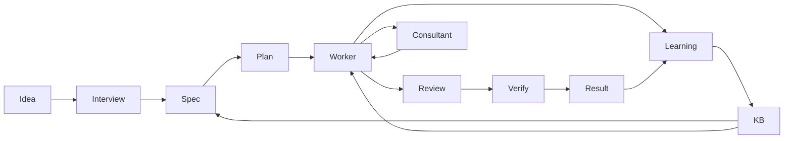

# Siesta 💤

Turn a project idea into a specification, an implementation and a verified
result. Siesta interviews you, breaks the work into issues, runs coding agents,
and records the decisions and evidence needed to inspect their work.

It is designed for small applications that run on your computer. Generated
code still needs your review before use.

## How it works



The orchestrator is Python: `python3 -m pipeline`. It selects a configured role
and invokes the [Pi coding agent](https://github.com/earendil-works/pi/tree/main/packages/coding-agent),
which connects to Ollama and provides the worker's file and shell tools.
The reviewer uses the worker role; the approval proxy and learner use the
consultant role.

| Role | Work | Default model |
|---|---|---|
| Planner | Interview, specification, issue plan | `glm-5.2:cloud` |
| Worker | Implementation, code review, verification | `gemma4:31b-cloud` |
| Consultant | Advice, approval proxy, learning | `glm-5.2:cloud` |

Models are selected explicitly in
[`factory/config/models.json`](factory/config/models.json).
There is no automatic model selection. Python prints the actual assignments
at startup.

**The default models run on Ollama Cloud.** The local Ollama daemon acts as
their proxy. For inference entirely on your own machine, follow the
[local Ollama guide](docs/ollama-local.md), including the native tool probe
and served-context check.

## Installation

Requirements: Python 3.10+, Git, Bash, Node.js supported by Pi, and a running
Ollama installation. Run these commands from the cloned repository root:

```bash
python3 -m venv .venv
source .venv/bin/activate
python -m pip install pytest
npm install -g --ignore-scripts @earendil-works/pi-coding-agent
ollama list
pi --help
```

The Python orchestrator uses the standard library. Keep pytest available in
the active environment for generated Python projects and the regression suite.
All 15 agent skills are included in the repository.

Git must be configured to create commits with your chosen public attribution.
Generated projects have their own Git repositories.

Configure access to the selected models before starting. Cloud routing requires
Ollama Cloud access; local routing uses the
[isolated Ollama profile](docs/ollama-local.md#create-an-isolated-profile).
Register each model in Pi with its actual served context window.

## Usage

Start an interview:

```bash
./factory/bin/siesta.sh 'Build a small Python CLI timer with tests'
```

For an already detailed request, skip the interview:

```bash
./factory/bin/siesta.sh --auto 'Build a Python CLI that adds two integers, with pytest tests in every issue'
```

Resume with the same idea and model profile:

```bash
./factory/bin/siesta.sh --auto --resume 'Build a Python CLI that adds two integers, with pytest tests in every issue'
```

Existing projects resume from their saved state, including when relaunched
without `--resume`. A changed idea that collides with an existing project
directory is rejected. Put a `stop.md` file in the generated project to stop
at the next issue boundary; remove it before continuing.

Results appear under `factory/projects/<project>/`, or under the selected
profile's `factory/projects/`:

| Artifact | Purpose |
|---|---|
| `spec.md`, `issues.md` | Requirements and implementation plan |
| Source and tests | Generated application |
| `kb/graph.json` | Decisions, completed issues and blockers |
| `verify_verdict.txt` | Persisted verification result |
| `.pipeline-checkpoint` | Resume position |
| `*_output.txt`, `regression_*.log` | Local execution evidence |
| `.git/` | Project commits and recovery archives |

Completion requires passing mechanical tests, successful review and verification,
and no pending issues. Failed checks leave evidence and a nonzero exit status.
A requested stop is a clean halt, so exit status alone does not prove completion.

## Reliability and learning

Each issue loads relevant KB summaries and standing principles. The worker
implements and tests it; Python checks the suite before recording completion.
A blocked issue's uncommitted changes are archived before cleanup, and successful
regression repairs are committed before further work begins.

Review requires an explicit passing marker and proxy approval. Verification
reruns tests and, where supported, a runtime smoke check. Empty suites,
unmarked responses and quoted protocol examples cannot establish success.

The learner records patterns and may update the five factory skills.
The global KB is local runtime data, initialized from the six principles in
[`global-seed.json`](factory/kb/global-seed.json). Learned history, generated
projects, credentials and run logs stay outside the tracked source tree.
Review any learned skill changes before publishing them.

## Development

Run the test suite from the repository root with the Python environment active:

```bash
cd factory
python -B -m unittest discover -s tests -v
```

[Testing](docs/testing.md) explains what these checks establish and how to
validate a real model. [AGENTS.md](AGENTS.md) describes phase contracts,
recovery, model configuration and the code layout.

## License and credits

Siesta is [MIT licensed](LICENSE). Its agent workflows adapt
[agent-skills](https://github.com/addyosmani/agent-skills); the corresponding
license is preserved in [third-party notices](THIRD_PARTY_NOTICES.md).
The execution loop also draws inspiration from
[Ralph](https://github.com/SantanderAI/ralph).
