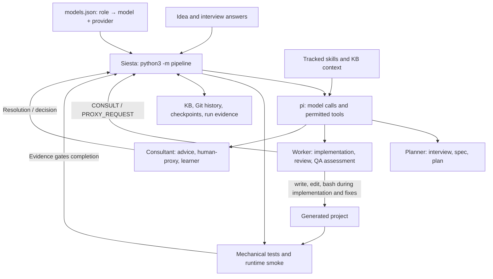

# Siesta

**"Give me an idea, go take a siesta, come back to working code."**

Siesta is an autonomous development pipeline for projects that run on your own computer. Give it an idea, answer the interview, and let it write a spec, implement issues, review the code and run checks. It keeps a Git repository and a knowledge base of decisions; incomplete work remains recorded as incomplete.

The orchestrator is **Siesta's own Python pipeline**, invoked with `python3 -m pipeline`. It calls the [Pi coding agent](https://github.com/earendil-works/pi/tree/main/packages/coding-agent) to access models and execute tools. The repository defaults to **Ollama Cloud**: GLM 5.2 for planning and consulting, Gemma4 31B for implementation. For local inference, use the tracked [Ollama setup guide and templates](docs/ollama-local.md). Files and checks run locally; model inference runs where the selected provider serves it.

---

## How It Works

```
You:  "Build me a CLI pomodoro timer in Python"
      ↓
Phase 0: The planner interviews you about what you want
         You answer. You leave. 💤
      ↓
Phase 1: The planner writes the spec autonomously
Phase 2: The planner breaks it into ordered issues
Phase 3: The worker executes each issue:
         ├─ Writes code + tests (TDD: Red → Green → Refactor)
         ├─ Stuck? → consultant role resolves the doubt
         ├─ 3 fails? → Deep diagnosis (root-cause analysis)
         ├─ Need approval? → Human-proxy decides based on KB
         ├─ Regression suite runs before each new issue
         └─ Tests gate completion; learner runs after completed issues
Phase 4: Review + proxy approval; a fix requires a fresh review
Phase 5: Model assessment + actual regression and runtime checks
Phase 6: Record the real verdict and final git commit
Phase 7: Analyze project learnings and proposed skill updates
      ↓
You:  Inspect the result, test evidence, Git history and any blockers.
```

---

## Architecture

### Orchestrator

[`__main__.py`](factory/pipeline/__main__.py) dispatches phases and manages
checkpoints and resume. [`phases.py`](factory/pipeline/phases.py) implements
execution, recovery, review, verification and commits.
[`pi.py`](factory/pipeline/pi.py) passes the selected role's model and provider
to `pi`, controls tools and timeouts, and captures model output. In the default
profile, the Ollama daemon proxies inference requests to Ollama Cloud. At
startup Python prints the active configuration as a relative path and the
model/provider assigned to each role, including alternative profiles.


```mermaid
flowchart TD
    Human["Idea and interview answers"] --> Pipeline["Siesta: python3 -m pipeline"]
    Config["models.json: role → model + provider"] --> Pipeline
    Pipeline --> Pi["pi: model calls and permitted tools"]
    Pi --> Planner["Planner: interview, spec, plan"]
    Pi --> Worker["Worker: implementation, review, QA assessment"]
    Pi --> Consultant["Consultant: advice, human-proxy, learner"]
    Worker -->|"CONSULT / PROXY_REQUEST"| Pipeline
    Consultant -->|"Resolution / decision"| Pipeline
    Worker -->|"write, edit, bash during implementation and fixes"| Product["Generated project"]
    Pipeline --> Checks["Mechanical tests and runtime smoke"]
    Product --> Checks
    Checks -->|"Evidence gates completion"| Pipeline
    Pipeline <--> State["KB, Git history, checkpoints, run evidence"]
    Skills["Tracked skills and KB context"] --> Pi
```

### Models and selection

Model selection is **manual, by role**. At startup, Siesta reads the `model`
and `provider` fields for `planner`, `worker` and `consultant` from
[`factory/config/models.json`](factory/config/models.json). Each phase requests
one of those roles; `pi` receives explicit `--model` and `--provider` flags.
The human-proxy and learner both use `consultant`. Retries and deep diagnosis
keep these assignments; there is no automatic model selector based on task difficulty.

The committed defaults are:

| Model | Roles | When |
|-------|-------|------|
| **GLM 5.2** (Ollama Cloud, via `pi`) | Planner, consultant, human-proxy, learner — the roles that must hold the text protocol | Phases 0–2, consultations, proxy decisions, per-issue + project learning |
| **Gemma4 31B** (Ollama Cloud) | Worker — the one that writes code, reviews and verifies | Phases 3–5 |

The split reflects earlier runs: planner and consultant roles need reliable
text markers such as `INTENT_FINALIZED:` and `APPROVED`, while implementation
needs **native tool calling**. qwen2.5-coder was retired after
[ollama#12174](https://github.com/ollama/ollama/issues/12174) made it return tool
calls as plain text, so it could not write files or run tests at all; gemma4 was
verified end-to-end (real `tool_calls` via `/v1`, tools executed by pi) before adoption.

The local Ollama template provides a separate setup:

| Setting | Committed default | Local Ollama template |
|---------|-------------------|-------------------------|
| Planner | `glm-5.2:cloud` | `siesta-local:latest` |
| Worker | `gemma4:31b-cloud` | `siesta-local:latest` |
| Consultant, proxy, learner | `glm-5.2:cloud` | `siesta-local:latest` |
| Provider | `ollama` | `ollama` |
| Inference | Ollama Cloud through the local daemon | Local Ollama at `http://localhost:11434/v1` |

To change a role, edit its `model` and `provider`, register that exact pair in
Pi's model catalog, and start a new pipeline process. Verify native tools and
the actual served context window before using a new worker. The alias above
is created from your chosen local model. The guide includes context setup and
a real write/bash/read probe; the template alone is not model validation.

`SIESTA_FACTORY` selects an alternative factory directory, including its
`config/models.json`, projects, KB and factory skills; it must contain those
resources and have `.agents/skills/` in its parent directory.
`PI_CODING_AGENT_DIR` selects the separate Pi profile containing `models.json`.
The [Ollama guide](docs/ollama-local.md) creates an isolated profile under the
Git-ignored `.runtime/ollama-local/`. A fresh clone includes both templates;
you supply the installed model and running Ollama daemon. See
[configuration details](AGENTS.md#model-routing) for role selection.

Every model call goes through one wrapper ([`factory/pipeline/pi.py`](factory/pipeline/pi.py))
that enforces two rules the pipeline depends on:

- **One positional prompt** — body and directive merged (data first, directive last).
  pi 0.84.3 stopped delivering `--append-system-prompt` content, so the old shape
  showed the model the format but not the subject.
- **Thinking pinning** — the requested `--thinking` level is forwarded only for known
  thinking models (GLM); every other model is pinned to `off`, so a
  misrouted call can never 400 with "does not support thinking".

### Pipeline (8 phases, numbered 0–7)

| Phase | What happens | Role |
|-------|-------------|------|
| 0 — Interview | Interactive Q&A to clarify the idea; human leaves after | planner |
| 1 — Spec | Autonomous spec generation (tech stack, features, acceptance criteria) | planner |
| 2 — Plan | Break spec into ordered, atomic issues with dependencies | planner |
| 3 — Execute | Autonomous loop: implement each issue with TDD, consult when stuck | worker |
| 4 — Review | Code review across 5 axes; human-proxy approves | worker + consultant |
| 5 — Verify | Read-only model assessment; Python runs regression and runtime checks and persists the verdict | worker + orchestrator |
| 6 — Done | Record decision or blocker and commit according to the verdict | orchestrator |
| 7 — Learn | Cross-issue analysis; log learnings and apply accepted skill updates | consultant (learner) |

### Knowledge Base (KB)

File-based JSON graph with progressive disclosure — agents load summaries first (cheap), drill into detail only when needed.

- **Per-project KB** (`factory/projects/<name>/kb/graph.json`): decisions, blockers, consultations, learnings for one project
- **Global KB** (`factory/kb/global-graph.json`): accumulated patterns across all projects

**Node types:** `intent`, `spec`, `issue`, `decision`, `blocker`, `consultation`, `proxy_decision`, `learning`

**Edge types:** `applied_to`, `caused_by`, `resolved_by`, `depends_on`, `parent_of`, `consulted_for`, `learned_from`

Schema defined in [`factory/kb/schema.json`](factory/kb/schema.json).

### Skills

**10 skills from [addyosmani/agent-skills](https://github.com/addyosmani/agent-skills)** (with factory-tailoring sections for the autonomous, no-tools output protocol):

`interview-me`, `spec-driven-development`, `planning-and-task-breakdown`, `incremental-implementation`, `test-driven-development`, `debugging-and-error-recovery`, `code-review-and-quality`, `code-simplification`, `git-workflow-and-versioning`, `using-agent-skills`

**5 custom factory skills:**

| Skill | What it does |
|-------|-------------|
| [`issue-executor`](factory/skills/issue-executor/SKILL.md) | The worker's playbook for executing a single issue (TDD, stuck detection, KB logging) |
| [`consultant-protocol`](factory/skills/consultant-protocol/SKILL.md) | The consultant's playbook for resolving doubts when the worker gets stuck |
| [`human-proxy`](factory/skills/human-proxy/SKILL.md) | Replaces human approval using KB context (evaluates against original intent) |
| [`kb-manager`](factory/skills/kb-manager/SKILL.md) | Read/write/query the JSON KB graph with progressive disclosure |
| [`factory-learner`](factory/skills/factory-learner/SKILL.md) | Analyzes completed issues and project outcomes; can update factory skills |

### Safety Features (inspired by [SantanderAI/ralph](https://github.com/SantanderAI/ralph))

| Feature | How it works |
|---------|-------------|
| `stop.md` | Any agent can create `stop.md` in the project dir to halt the pipeline cleanly |
| Regression suite | All previous tests re-run before each new issue — a red suite gets one worker-driven repair attempt, then gates the next one (skipped, logged, never built on a broken base); two consecutive unrepairable suites halt the run. An empty suite (pytest "no tests collected") is absence — never a failure |
| Degenerate-output guard | Tool-call JSON, questions to the absent human, or truncated output are treated as failed attempts — never as success; a degenerate first answer gets one feedback retry; every consultation, proxy and diagnosis retry is checked, and unresolved requests stay blocked |
| Call timeout | Every `pi`/Ollama call is capped by `SIESTA_PI_TIMEOUT` (1200s default) — a hung call returns empty and counts as a failed attempt instead of freezing the pipeline (`stop.md` only works between issues). The interview deadline also covers open stdout and kills its process group while preserving partial text |
| Explicit approval signal | Proxy gates are fail-closed: only a line-start `APPROVED` marker continues the pipeline. `NEEDS_REVISION`, hesitation, or garbage retry with feedback — unmarked output can never count as approval |
| Honest verify verdict | `verify()` persists its verdict to `verify_verdict.txt`; resume reads it (never invents a pass), every verification runs the actual test suite. Red or absent tests cannot pass, even with a model approval; failed verification leaves an `UNVERIFIED` commit and exits 1 |
| Idempotent resume | Issues with an "Issue #N completed" KB decision node are skipped on `--resume`; pending issues retry even after a later or legacy `complete` checkpoint, invalidating downstream review and verification. Failed verification resumes at verify; only verified projects without pending issues reach `complete` |
| Review gate | One fix attempt is followed by a fresh review of the files. Both `REVIEW_PASSED` and explicit proxy approval are required; otherwise the phase stays pending and exits 1 |
| Product recovery | Blocked work is backed up under `.git/siesta-recovery/`, then tracked files and the index restore from HEAD and untracked product files are removed. KB and ignored evidence survive |
| Verified repair preservation | Python commits a passing regression repair before starting the next issue. If that commit fails and work remains dirty, execution halts with the repair preserved |
| Post-issue tests | Every issue requires a passing mechanical suite before its completion node and commit are written; no tests means blocked |
| Spec relevance guard | A spec sharing zero content words with the interview intent is rejected as a template hallucination — one retry with feedback, then abort |
| Fence-aware spec parsing | Language-tagged fence regions are cut before parsing — a spec with a small code example parses, but fenced lines never reach spec.md (a fenced `###` can't pose as a section; an answer fenced whole as code is a dump); bare fenced prose blocks are kept as illustration |
| Planner retries | A spec/plan answer that is unusable (generic template, no `## Issue #N:` headers) gets one directive retry demanding the exact format before the honest fallbacks |
| Generated hygiene | Project init writes a standard `.gitignore` (`.DS_Store`, `__pycache__/`, checkpoints) before the first `git add -A` |
| Consultant-guided retries | Two resolution-guided retries before deep diagnosis on a failing issue |
| Deep diagnosis | After 3 failures, the consultant does a root-cause analysis instead of blindly retrying |
| Blocker logging | Stuck issues are logged to KB and skipped; pipeline continues |
| Skill-update guard | Updates are restricted to factory skills and checked for minimum structure and length; this does not establish their semantic quality |

### Self-Improvement Loop

After each **completed issue**, the learner uses the configured consultant
model to analyze the recorded outcome:

```
Issue completed with passing tests
  ↓
learn_issue() runs
  ├─ Did I get stuck? Why? → Add Red Flag to issue-executor skill
  ├─ Did the consultant help? About what? → Could the skill cover this?
  ├─ Did proxy reject? Why? → Don't repeat that mistake
  ├─ What went well? → Log as best practice to global KB
  └─ Novel pattern? → Create new factory skill
  ↓
Parsed learnings enter the global KB; accepted updates modify factory skills.
```

The project-level pass looks for patterns across issues. A pass can produce
zero learnings; these hooks do not guarantee useful improvements on every run.

### Validated status — 2026-09-11

The reliability work passed **215 Siesta tests**. Four local Qwen-generated
projects — Caesar cipher, word count, temperature conversion and line deduplication —
finished with `complete` and `VERIFY_PASSED`. Independent rechecks passed
**62 generated tests and 14 CLI contract checks**. The generated products were
implemented by the local model; the Siesta reliability fixes were made by Codex.
Those historical runs used vLLM. They do not validate the new Ollama template.

These results cover small Python CLIs on Linux. The
[validation report](tasks/reliability-validation-20260911.md) records the retained
failures, dedupe's successful resume, and the limits of the checks. Raw logs and
generated projects remain local under `.runtime/` and are excluded from Git.

---

## Installation

### Prerequisites

- Python and Git on `PATH`; the latest local validation used Python 3.12.3
- `pytest` in the active Python environment for Python project regression checks
- [Pi](https://github.com/earendil-works/pi/tree/main/packages/coding-agent#quick-start) coding agent and its Node.js requirements
- For the default profile: [Ollama](https://ollama.com) running locally and authenticated for Ollama Cloud, with access to `glm-5.2:cloud` and `gemma4:31b-cloud`
- For local inference: follow the [local Ollama setup](docs/ollama-local.md) with a downloaded model and matching Pi catalog

```bash
# Install Pi using the package named in its upstream quick start
npm install -g --ignore-scripts @earendil-works/pi-coding-agent
```

> **Note:** also register the worker in pi's user catalog (`~/.pi/agent/models.json`)
> with its real context window — pi's custom-model-id fallback silently clones
> another model's metadata (glm's 1M window), which disables correct compaction.

All 15 skills (10 from addyosmani + 5 factory) are tracked in this repository,
so cloning brings them — no separate skill install step is needed.

### Setup

```bash
# Clone — https://github.com/jairorodriguezarias/siesta brings all 15 skills
# (.agents/skills/ + factory/skills/, tracked in git)
git clone https://github.com/jairorodriguezarias/siesta.git
cd siesta

# Keep Python available for the pipeline and generated subprocess tests
python3 -m venv .venv
source .venv/bin/activate
python -m pip install pytest

# Make the entry point executable
chmod +x factory/bin/siesta.sh

# Verify Ollama is running (it proxies to your Ollama Cloud account)
ollama list

# Verify Pi is configured
pi --help
```

No view or skill setup is needed beyond the clone: the pipeline loads every
skill with explicit `--skill <path>` flags pointing at the tracked sources
(`.agents/skills/`, `factory/skills/`).

---

## Usage

```bash
# From the repository root, with the Python environment active

# Give it an idea and answer the interview questions
./factory/bin/siesta.sh "Build a CLI pomodoro timer in Python"

# The agent will ask you questions to clarify what you want.
# Answer them. Then leave. 💤

# When you come back:
ls factory/projects/
# → pomodoro-timer-in-python/
#     ├── .git/          (full commit history)
#     ├── spec.md         (the spec the planner wrote)
#     ├── issues.md       (the issues the planner generated)
#     ├── src/            (the code the worker wrote)
#     ├── tests/          (the tests)
#     └── kb/graph.json   (decisions, blockers, learnings)
```

For the Python entry point and an already specified idea:

```bash
PYTHONPATH=factory python3 -m pipeline --auto "Build a CLI pomodoro timer in Python"

# Resume the same idea, retaining completed issues
PYTHONPATH=factory python3 -m pipeline --auto --resume "Build a CLI pomodoro timer in Python"
```

Normal successful completion requires a persisted passing verdict and no pending
issues. Failed review or verification and unresolved issues leave evidence and
exit 1; a `stop.md` request is a separate clean halt. Check the project's
`.pipeline-checkpoint`, `verify_verdict.txt` and KB for its actual state.

To run Siesta's own tests from the repository root:

```bash
cd factory
python -B -m unittest discover -s tests -v
```

### Emergency Stop

Create a `stop.md` file in the project directory to halt the pipeline:

```bash
echo "Something seems wrong, let me check" > factory/projects/my-project/stop.md
```

---

## Project Structure

```
siesta/
├── factory/
│   ├── bin/
│   │   └── siesta.sh              # Entry point
│   ├── pipeline.log               # Full orchestrator narration (runtime, gitignored via *.log)
│   ├── pipeline/                  # Python orchestrator (run with python3 -m pipeline)
│   │   ├── __main__.py            # Checkpoint, failure trap, phase dispatch, summary
│   │   ├── phases.py              # Phase bodies 0-7 (interview, spec, plan, execute ladder…)
│   │   ├── learn.py               # Per-issue + project-level learning
│   │   ├── pi.py                  # Single run_pi() wrapper — every model call
│   │   ├── kb.py                  # KB graph store + python3 -m pipeline.kb CLI shim
│   │   └── text.py                # Marker regexes + pure parsers
│   ├── tests/                     # Unit + fake-pi integration tests
│   ├── BACKLOG.md                # Findings + corrections backlog (also a changelog)
│   ├── skills/                    # 5 custom factory skills
│   │   ├── issue-executor/SKILL.md
│   │   ├── consultant-protocol/SKILL.md
│   │   ├── human-proxy/SKILL.md
│   │   ├── kb-manager/SKILL.md
│   │   └── factory-learner/SKILL.md
│   ├── kb/
│   │   ├── global-graph.json      # Cross-project accumulated learnings
│   │   ├── graph.json             # Template KB
│   │   └── schema.json            # Node/edge type definitions
│   ├── config/
│   │   └── models.json            # Model routing config
│   └── projects/                  # Output: built projects land here
│
├── .agents/
│   ├── skills/                    # 10 addyosmani skills (factory-tailored)
│   ├── agents/
│   │   └── code-reviewer.md       # code-reviewer persona
│   ├── references/
│   │   ├── definition-of-done.md
│   │   └── security-checklist.md
│   └── hooks/
│       ├── pre-issue.sh
│       └── post-issue.sh
│
├── AGENTS.md                      # Agent system documentation
├── docs/ollama-local.md           # Local Ollama setup and native-tool probe
├── tasks/reliability-validation-20260911.md  # Results and limitations of local runs
├── LICENSE                        # MIT
└── .gitignore
```

---

## Acknowledgments

### [addyosmani/agent-skills](https://github.com/addyosmani/agent-skills)

> Production-grade engineering skills for AI coding agents.

Siesta uses 10 of the 24 skills from this repository. The skill anatomy, anti-rationalization tables, verification gates, and progressive disclosure patterns all come from Addy Osmani's work. The lifecycle (DEFINE → PLAN → BUILD → VERIFY → REVIEW → SHIP) and the `definition-of-done.md` reference are directly from this project.

### [SantanderAI/ralph](https://github.com/SantanderAI/ralph)

> A configurable Bash/PowerShell loop that runs an AI coding CLI with a fresh session each iteration.

Siesta borrows several safety patterns from Ralph:

- **`stop.md`** signal — any agent can halt the pipeline cleanly
- **Regression suite** — re-run all previous tests before each new issue
- **Consultant escalation** — resolution-guided retries followed by deep diagnosis
- **Deep diagnosis** — after 3 failures, trigger root-cause analysis instead of blindly retrying
- **Per-task learning** — improve skills after each task
- **Workspace continuity** — all state lives in files (KB + git), not in the session

---

## License

MIT — see [LICENSE](LICENSE).

## Author

Built with 💤 by [Jairo Rodriguez Arias](https://github.com/jairorodriguezarias)
